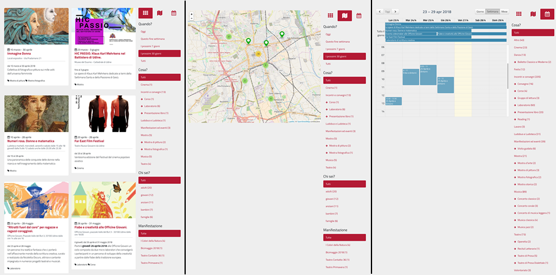

.. _h56602a3658453324676b65644fbe7e:

Manuale OpenAgenda
******************

Con OpenAgenda, la P.A. propone un significativo cambio di paradigma rispetto al passato: rende autonomi e responsabilizza i cittadini nella gestione degli eventi pubblici, mantenendo un ruolo di coordinamento e di validazione dell’intero processo, a garanzia del suo corretto funzionamento.

OpenAgenda è un \ |STYLE0|\ , che gestisce principalmente contenuti di due tipi:

\ |STYLE1|\  - gli eventi che avvengono sul territorio

\ |STYLE2|\  - schede che rappresentano le associazioni presenti sul territorio.

.. _h59626249a40664f615e03447347d68:

Esempio tipico di funzionamento
===============================

La situazione più comune è quella che vede le associazioni territoriali che curano la propria scheda (mantenendo aggiornati i dati) e caricano i propri eventi sul sistema OpenAgenda. Una redazione centrale si occupa poi della moderazione degli eventi, aggiustando eventuali errori, inserendo eventuali informazioni mancanti e/o immagini, prima di renderli visibili sul calendario.

.. admonition:: Collaborazione e moderazione

    Due concetti fondamentali per comprendere il funzionamento di OpenAgenda sono \ |STYLE3|\  e \ |STYLE4|\ : OpenAgenda può infatti essere configurato per la collaborazione, in modo da consentire l’inserimento di eventi da parte di utenti esterni (le Associazioni). Inoltre è possibile attivare la moderazione in modo che la pubblicazione degli eventi inseriti dalle associazioni venga validata da una redazione centrale prima di essere resi visibili sul calendario.

.. _h1522732954b123f6337262c2d262917:

Visualizzazione degli eventi
============================

Gli eventi caricati sul sistema OpenAgenda sono visibili in tre modalità:

* \ |STYLE5|\  Gli eventi vengono mostrati in una lista che li presenta in ordine cronologico per data di inizio. E” possibile filtrare per periodo (es. «i prossimi 7 giorni», «i prossimi 30 giorni» ), per tipologia evento, per destinatari.

* \ |STYLE6|\  La rappresentazione a calendario è utile per verificare la concomitanza di eventi in una stessa giornata, o per verificare la presenza di eventi in un determinato periodo.

* \ |STYLE7|\  In fase di inserimento eventi, viene richiesto di inserire la geolocalizzazione. Questo consente di rappresentare i contenuti su una mappa, come illustrato in figura.

\ |IMG1|\ 

\ |STYLE8|\ 

..  Important:: 

    OpenAgenda è stato progettato e implementato per garantire una visualizzazione ottimale sui dispositivi mobili. Per questo motivo la rappresentazione standard degli eventi è quella a lista, che risulta la più facilmente fruibile da quei dispositivi.

.. _h514e1126126541f91fe5f68386965:

Tipi di accesso
===============

Gli utenti che possono accedere al sistema OpenAgenda sono:

* \ |STYLE9|\  possono gestire le configurazioni del sistema (attivare la modalità collaborativa, attivare la moderazione, modificare titoli e testi generali);

* \ |STYLE10|\  possono inserire eventi, modificare tutti gli eventi inseriti, moderare gli eventi inseriti dalle Associazioni;

* \ |STYLE11|\  possono gestire la propria scheda e inserire eventi;

* \ |STYLE12|\  se il sistema dei commenti è attivato, utenti registrati possono inserire dei commenti sotto gli eventi inseriti nel sistema

.. _h3e7c450161b324e527373343e537c6b:

Gli stati degli eventi: cosa sono e a cosa servono
==================================================

Nel sistema OpenAgenda, ogni evento inserito viene associato a un particolare stato, che definisce la condizione in cui quell’evento si trova e ne regola la visibilità sul calendario web.

Un evento può passare di stato attraverso un flusso stabilito. Tipicamente (con moderazione attiva), gli stati associabili ad un evento sono:

* \ |STYLE13|\  un nuovo evento viene associato a questo stato

* \ |STYLE14|\  quando un’associazione vuole pubblicare il proprio evento, lo sposta da “in lavorazione” a “in moderazione”. Una email viene inviata al gruppo dei moderatori.

* \ |STYLE15|\  un moderatore controlla l’evento (in stato “In moderazione), apporta eventuali controlli e correzioni, e poi imposta lo stato “Accettato”. Un evento in questo stato è visibile sul calendario web

* \ |STYLE16|\  un moderatore controlla l’evento (in stato “In moderazione) e decide di non pubblicarlo sul calendario web (ad esempio perché è incompleto, o un duplicato di un altro evento esistente). Assegna questo stato. Gli eventi in questo stato non sono visibili sul calendario web.

La descrizione del funzionamento del sistema OpenAgenda si divide in due parti: un manuale per \ |STYLE17|\ , e un manuale per \ |STYLE18|\ 

.. toctree:: 

    manuale_amministratori.rst

    manuale_associazioni.rst

.. bottom of content

.. |STYLE0| replace:: **calendario web collaborativo**

.. |STYLE1| replace:: **Eventi**

.. |STYLE2| replace:: **Associazioni**

.. |STYLE3| replace:: **collaborazione**

.. |STYLE4| replace:: **moderazione**

.. |STYLE5| replace:: **Lista (con filtri).**

.. |STYLE6| replace:: **Calendario.**

.. |STYLE7| replace:: **Mappa.**

.. |STYLE8| replace:: *Visualizzazione a lista, mappa e calendario in OpenAgenda*

.. |STYLE9| replace:: **Utenti amministratori:**

.. |STYLE10| replace:: **Utenti moderatori:**

.. |STYLE11| replace:: **Associazioni:**

.. |STYLE12| replace:: **Utenti registrati:**

.. |STYLE13| replace:: **In lavorazione:**

.. |STYLE14| replace:: **In attesa di moderazione:**

.. |STYLE15| replace:: **Accettato:**

.. |STYLE16| replace:: **Rifiutato:**

.. |STYLE17| replace:: **Associazioni e Istituti culturali**

.. |STYLE18| replace:: **Amministratori e Moderatori.**

