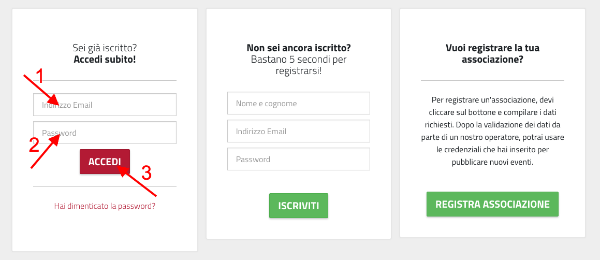
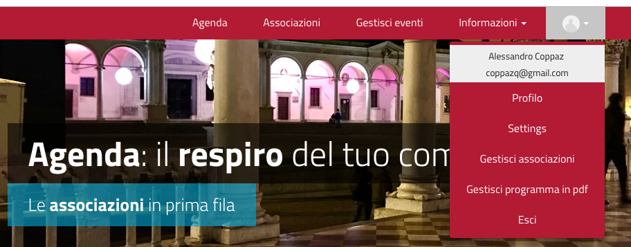
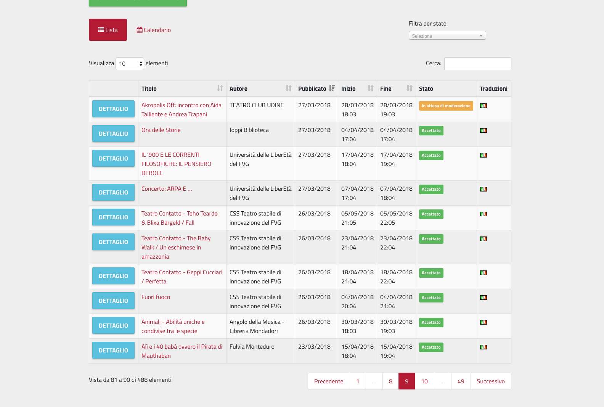
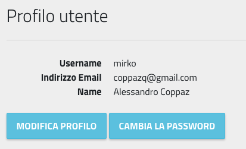
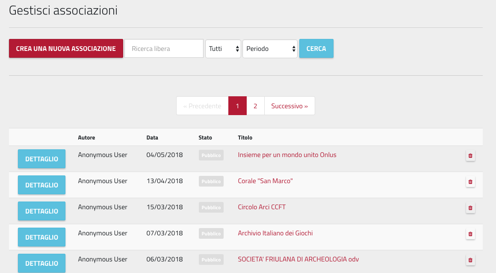
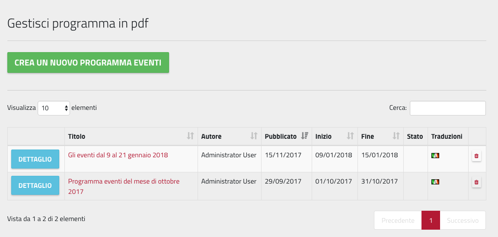
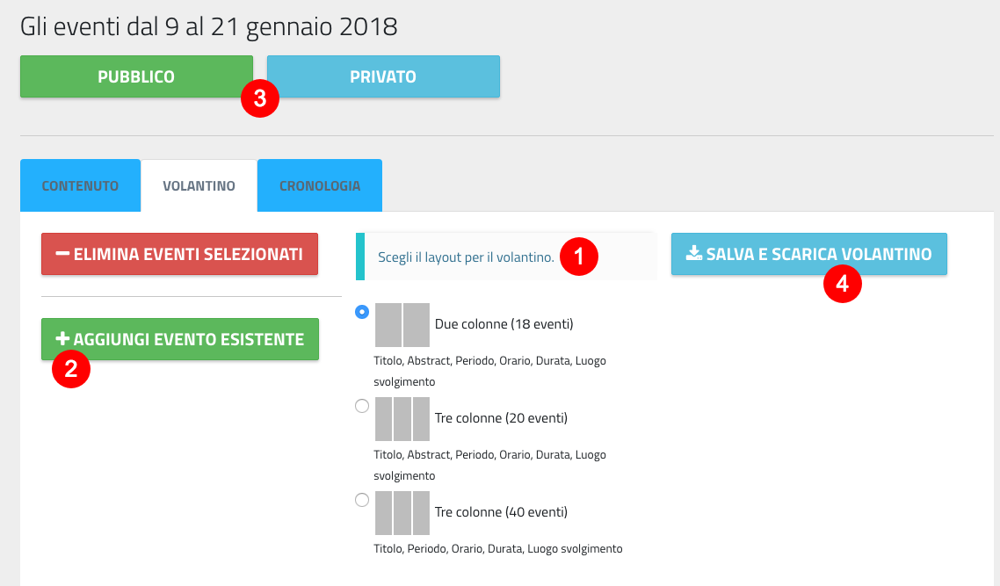
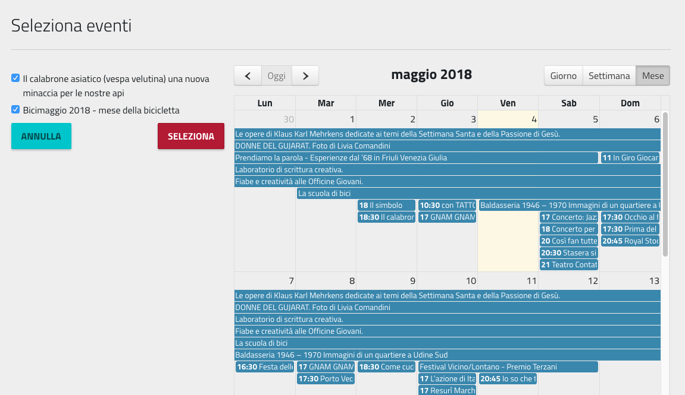

.. _h5e5f7e4f81f11d67d91a427c6e72:

Manuale per Amministratori e Moderatori
***************************************

Amministratori e Moderatori di OpenAgenda si occupano di gestire le configurazioni a disposizione, di moderare i contenuti inseriti dalle Associazioni, e in generale di supervisionare le attività sul calendario.

.. _h747c29135f33116633702768182763:

Registrazione al sistema
========================

Le credenziali per amministratori e moderatori vengono create d’ufficio e comunicate ai diretti interessati, che sono quindi in possesso di \ |STYLE0|\  (nome utente) e \ |STYLE1|\ .

.. _h6e4d39105a64461f4f3377d353919:

Accesso al sistema
==================

Per accedere al sistema è necessario selezionare la voce «accedi» dalla barra menù del sito.

\ |IMG1|\ 

\ |STYLE2|\ 

Il sistema presenta un form di login. Per accedere è necessario inserire i propri username e password, per poi premere su “Accedi”.

\ |IMG2|\ 

\ |STYLE3|\ 

..  Important:: 

    Utilizzando il link “Hai dimenticato la password?” è possibile chiedere al sistema di creare una nuova password che verrà inviata all’indirizzo email specificato.

Una volta effettuato l’accesso, le operazioni che è possibile svolgere sono:

* Gestione e moderazione degli eventi;

* Gestione del proprio profilo utente;

* Gestione delle impostazioni generali;

* Gestione delle associazioni;

* Gestione del programma pdf;

Mentre la gestione degli eventi è raggiungibile da una voce sul menù principale (Gestisci eventi), per accedere alle altre operazioni è necessario cliccare sull’icona del profilo che si trova sulla barra menù, per poi selezionare la voce di interesse.

\ |IMG3|\ 

.. _h4611f40231a11512e7c3d735b5e5c66:

Gestione e moderazione degli eventi
===================================

La gestione e moderazione degli eventi avviene attraverso una dashboard sulla quale amministratori e moderatori possono vedere tutti gli eventi inseriti nella piattaforma, ognuno con le informazioni principali: chi lo ha inserito, quando, quando inizia e quando finisce. Inoltre ci sono informazioni sullo stato.

Cliccando sul pulsante “Dettaglio” si accede al dettaglio dell’evento, dove si possono operare modifiche e assegnare lo stato.

\ |IMG4|\ 

\ |STYLE4|\ 

.. _h4624c19596c6969246833368586b43:

Gestione del proprio profilo utente
===================================

Dopo aver cliccato sull’icona del profilo sulla barra dei menù, selezionando la voce “Profilo”, si  accede al proprio profilo utente. Da qui è possibile re-impostare la password oppure modificare i propri dati (nome, cognome, indirizzo email e password, mentre \ |STYLE5|\ )

\ |IMG5|\ 

.. _h696e1c33204020e78751b3a69e7ae:

Gestione delle impostazioni generali
====================================

Le impostazioni generali del sistema OpenAgenda sono raggiungibili premendo l’icona del profilo sulla barra del menù e poi selezionando “Settings”. 

Da qui è possibile gestire gli aspetti generali del sistema: accesso utenti, definizione dei moderatori, definizione di calendari tematici (calendari con i soli eventi di una certa tipologia).

E’ inoltre possibile, cliccando su “Modifica impostazioni generali”, agire sulle impostazioni del sistema. Si presentano divise in tre sezioni:

\ |STYLE6|\ 

Dove specificare il nome dell’applicativo, il logo, l’immagine e il claim che compare in home page, inoltre informazioi quali Faq, Privacy e termini di utilizzo, che vengono poi visualizzate dagli utenti che visitano il sito web.

\ |STYLE7|\ 

Da questa sezione si definisce la modalità di funzionamento del sistema:

* \ |STYLE8|\ : la modalità collaborativa è quella che prevede che le associazioni possano accedere al sistema per l'inserimento di nuovi eventi

* \ |STYLE9|\ : se attivo, consente agli utenti registrati di commentare gli eventi

* \ |STYLE10|\ : consente alle associazioni di registrarsi direttamente dal sito. Una associazione che si registra deve essere “validata” dai moderatori prima di poter essere operativa.

* \ |STYLE11|\ : abilita la moderazione di tutti i nuovi eventi inseriti dalle associazioni. Se non viene attivata, tutti gli eventi inseriti sono direttamente visibili sul calendario web

\ |STYLE12|\ 

Dove è possibile definire alcune regole di visualizzazione. Ad esempio, è possibile fare in modo che eventi legati a una certa tematica non vengano mostrati nel calendario principale (perché ad esempio vengono mostrati in un calendario tematico).

.. _h7aa4364c1e33701ca487f5f4e6375:

Gestione delle associazioni
===========================

Nel caso in cui sia abilitata la registrazione delle associazioni al sistema, i moderatori hanno il compito di valutare le registrazioni stesse. Questo livello di moderazione è necessario per controllare i dati delle associazioni che si sono iscritte, ma anche per evitare iscrizioni doppie.

La gestione delle associazioni è raggiungibile dall’icona del profilo che si trova sulla barra menù, per poi selezionare “Gestisci associazioni”. 

Si arriva al cruscotto associazioni, che presenta la lista delle associazioni, ognuna con il proprio stato (pubblico o privato). Da qui è possibile \ |STYLE13|\  (nel caso di “registrazione d’ufficio”), \ |STYLE14|\ , \ |STYLE15|\  di una associazione (pulsante “Dettagli”) per modificarne i contenuti o \ |STYLE16|\ . 

\ |IMG6|\ 

..  Important:: 

    Solo le associazioni in stato “pubblico” sono visibili nel “registro associazioni” pubblico, ed hanno accesso al sistema per inserire i propri eventi.

.. _h0625e74485817157264564445e7f19:

Gestione del programma pdf
==========================

Questa funzionalità consente la creazione di un programma eventi che viene poi reso scaricabile sul sito in formato pdf. Cliccare l’icona del profilo che si trova sulla barra menù, per poi selezionare “Gestisci programma in pdf”. 

Si arriva alla pagina che mostra i vari programmi creati. Il più recente è quello che viene visualizzato sul sito. Si crea un nuovo programma eventi cliccando sull’apposito pulsante.

\ |IMG7|\ 

\ |STYLE17|\ 

Le informazioni da inserire sono: titolo, sottotitolo, descrizione, data inizio e data fine.

Una volta creato il programma, è necessario definirne il layout e aggiungere gli eventi: selezionare il programma appena creato (Dettaglio) e poi cliccare sul tab “Volantino”.

\ |IMG8|\ 

\ |STYLE18|\ 

Si può quindi scegliere il layout(1), tenendo conto del numero di eventi che si intende aggiungere. Poi si procede con la selezione degli eventi da inserire nel volantino (2).

Una volta che il volantino è pronto, impostarne lo stato (3) a “pubblico” per renderlo visibile sul sito. Prima di fare questo, è possibile scaricare il volantino per vederne una anteprima (4).

Una nota sulla selezione eventi: essa avviene attraverso una schermata che mostra sulla destra un calendario dal quale scegliere gli eventi (con un click sul titolo), e sulla sinistra la lista degli eventi scelti. Una volta che la lista sulla sinistra contiene tutti gli eventi da aggiungere al programma, cliccare sul pulsante “Seleziona”.

\ |IMG9|\ 

\ |STYLE19|\ 

.. bottom of content

.. |STYLE0| replace:: **username**

.. |STYLE1| replace:: **password**

.. |STYLE2| replace:: *La voce di menù «accedi» consente di effettuare l’accesso al sistema*

.. |STYLE3| replace:: *Il form di accesso al sistema*

.. |STYLE4| replace:: *La dashboard di gestione degli eventi*

.. |STYLE5| replace:: **lo username non è modificabile**

.. |STYLE6| replace:: **Contenuti principali**

.. |STYLE7| replace:: **Configurazioni**

.. |STYLE8| replace:: **Attiva modalità collaborativa**

.. |STYLE9| replace:: **Abilita i commenti**

.. |STYLE10| replace:: **Abilita l'auto registrazione delle associazioni**

.. |STYLE11| replace:: **Abilita la moderazione**

.. |STYLE12| replace:: **Visualizzazione**

.. |STYLE13| replace:: **creare una nuova associazione**

.. |STYLE14| replace:: **ricercare una associazione**

.. |STYLE15| replace:: **visualizzare i dettagli**

.. |STYLE16| replace:: **impostare lo stato**

.. |STYLE17| replace:: *La schermata di gestione del programma in pdf*

.. |STYLE18| replace:: *La gestione del del programma eventi.*

.. |STYLE19| replace:: *La schermata di selezione degli eventi da inserire nel programma.*

