.. _h42274333142f73584242e1d5a5965e:

Manuale per le Associazioni e Istituti Culturali
************************************************

Un soggetto (Associazione, Istituto Culturale, ...) può contribuire alla creazione

di eventi sul sistema OpenAgenda, in modo che essi siano visibili sul calendario.

\ |IMG1|\ 

.. _h747c29135f33116633702768182763:

Registrazione al sistema
========================

La registrazione al sistema dipende da come il sistema è configurato. Ci sono casi in cui l'iscrizione delle associazioni viene fatta d'ufficio da parte dell'ente, che poi ha cura di comunicare le credenziali alle associazioni. In alternativa le associazioni hanno la possibilità di iscriversi al sistema attraverso il link raggiungibile dalla home page del calendario, in basso:

\ |IMG2|\ 

\ |STYLE0|\ 

Il link porta al form di registrazione di una nuova associazione. I campi indicati con l'asterisco sono obbligatori.

In questa modalià, una associazione che si registra sceglie il proprio \ |STYLE1|\  e la propria \ |STYLE2|\ .

..  Important:: 

    Mentre la password può essere cambiata in ogni momento, non è possibile modificare il proprio username.

.. _h6e4d39105a64461f4f3377d353919:

Accesso al sistema
==================

Per accedere al sistema è necessario selezionare la voce "accedi" dalla barra menù del sito.

\ |IMG3|\ 

\ |STYLE3|\ 

Il sistema presenta un form di login. Per accedere è necessario inserire i propri \ |STYLE4|\  e \ |STYLE5|\ , per poi premere su "Accedi”

\ |IMG4|\ 

\ |STYLE6|\ 

..  Important:: 

    Utilizzando il link “Hai dimenticato la password?” è possibile chiedere al sistema di creare una nuova password che verrà inviata all'indirizzo email specificato.

.. _h8203b4a40f6f123c5e3978542e795f:

Gestione della propria "Scheda Associazione"
============================================

Una volta effettuato il primo accesso è importante inserire tutte le informazioni riguardanti la propria associazione (tra le più importanti certamente l'indirizzo e i contatti). Successivamente sarà altrettanto importante tenere aggiornati tali.

Per accedere alla modifica della scheda della propria associazione, premere sull’icona del “profilo” sulla barra del menù, e poi selezionare la voce “Profilo”.

\ |IMG5|\ 

Si accede al proprio profilo. Da qui è possibile re-impostare la password oppure modificare il profilo (la scheda Associazione). Premere sul pulsante “Modifica profilo” per accedere al form di modifica della scheda Associazione e compilarlo con tutte le informazioni necessarie.

\ |IMG6|\ 

Per garantire completezza di informazione si consiglia completare la maggior parte dei campi, e non solo quelli obbligatori. Una volta conclude le modifiche, premere il pulsante "salva" in fondo al form compilato.

.. _h4bcc4a1235322c7936517c63561b6f:

Gestione dei propri eventi
==========================

Per inserire un nuovo evento, premere sulla voce di menu “Gestisci eventi” del menù principale.

Si accede in questo modo al cruscotto eventi, dove ogni associazione vede l’elenco degli eventi che ha inserito nel sistema, ognuno con il proprio stato.

\ |IMG7|\ 

.. _h19607c3266c146e486c4d2f24132265:

Creazione di un nuovo evento
----------------------------

Per creare un nuovo evento utilizzare il pulsante “crea un nuovo evento”. Si apre una schermata dove inserire le informazioni rilevanti per il proprio evento, suddivise in 4 parti:

\ |STYLE7|\ 

dove inserire il titolo, descrizione, informazioni, costi.

\ |STYLE8|\  

dove inserire le date di inizio e fine, orario e durata dell’evento.

\ |STYLE9|\  

E’ qui possibile inserire il luogo dove avviene l’evento. Di fondamentale importanza è la possibilità di geolocalizzare il proprio evento su una mappa. Per fare questo è sufficiente inserire l’indirizzo nella casella di testo (1) e premere “invio”. Il sistema (basato su \ |LINK1|\ ) proporrà una lista da cui scegliere l’indirizzo. Una volta scelto, comparirà il marcatore (2). E’ possibile trascinare il marker stesso per posizionarlo in una posizione più precisa rispetto a quanto rilevato dal sistema. E’ possibile inoltre chiedere al sistema di individuare la nostra attuale posizione attraverso il pulsante “rileva posizione” (3). I campi visualizzati sotto la mappa (4) non sono  invece modificabili, e indicano l’indirizzo così come viene “interpretato” da OpenStreetMap e le coordinate legate al punto dove è posizionato il marcatore.

\ |IMG8|\ 

\ |STYLE10|\ 

In questa sezione è possibile specificare i destinatari cui è dedicato l’evento (Target), e la tipologia dell’evento stesso. Queste informazioni vanno ad alimentari i filtri che è possibile attivare in fase di visualizzazione degli eventi: ad esempio, “mostra gli eventi dedicati ai bambini” (filtro per destinatari), oppure “mostra gli eventi di tipo danza” (filtro per tipologia).

Da qui è anche possibile aggiungere l’evento a una iniziativa (raccolta di eventi), come spiegato in seguito in questo manuale.

Al fine di garantire la maggior completezza di informazione possibile, si raccomanda di riempire tutti i campi possibili, inclusi quelli non obbligatori (i campi obbligatori sono indicati da un asterisco vicino al nome).

Una volta concluso premere sul pulsante “Salva”. 

La creazione di un nuovo evento lo imposta in stato “In lavorazione”. Gli eventi in questo stato possono essere modificati. Una volta che le modifiche sono soddisfacenti, e l’evento è pronto per essere pubblicato, è necessario assegnargli lo stato “In attesa di moderazione”. Un evento “in attesa di approvazione” entra nel meccanismo di approvazione da parte dell’ente, e non è più modificabile dall’associazione.

Il moderatore definito dall’Ente provvederà ad esaminare i contenuti inseriti e ad approvarli. A quel punto l’evento sarà visibile a tutti i cittadini sul calendario web.

.. _h2d7e497084d3717fd752196a254d:

Cambiare stato a un evento
--------------------------

Per cambiare stato a un evento è necessario andare nella sua visualizzazione di dettaglio (dal cruscotto eventi, si clicca sul pulsante “dettaglio”). Sotto il titolo sono visualizzati gli stati. In verde lo stato attuale dell’evento. In azzurro quelli che è possibile impostare, in verde acqua quelli che non è possibile impostare.

\ |IMG9|\ 

Una associazione può impostare come unico stato “in attesa di moderazione”.

.. _h3139225723e5c661e3fc74134a730:

Aggiungere immagini ad un evento
--------------------------------

Una volta creato un evento, è possibile aggiungere delle immagini. Dal cruscotto eventi, identificare l’evento appena inserito e premere sul pulsante“Dettagli”. Selezionare quindi il tab “Galleria immagini”.

\ |IMG10|\ 

Premere sul pulsante “Nuovo” per caricare una nuova immagine dal proprio computer o il pulsante “Libreria” per utilizzare un’immagine già presente nell’archivio perché caricata in occasione di altri eventi.

\ |IMG11|\ 

Dalla Libreria è possibile selezionare le immagini da aggiungere al proprio evento attraverso il pulsante “+” (1). Le immagini selezionate vengono mostrate nel riquadro in alto. Premendo “Seleziona” (2), esse vengono aggiunte all’evento. E’ possibile anche filtrare le immagini per tipo di licenza (3), effettuare una ricerca (4), e modificare le informazioni di una immagine (5), come titolo, licenza, autore.

Per ogni immagine caricata è importante inserire le informazioni principali, e in particolar modo completare i campi riguardanti la licenza d’uso della foto e l’autore.

Le immagini possono venire modificate anche in seguito alla pubblicazione dell’evento. 

.. topic:: Si raccomanda di:

    

    * se possibile, evitare che non siano presenti scritte testuali sulle immagini caricate; in alcune visualizzazioni, potrebbero non essere leggibili;
    
    * applicare sempre la licenza d’uso.

.. _h22653f11c35601f7e4d7325721a7e4b:

Inserire di una iniziativa
==========================

Una iniziativa rappresenta un raggruppamento di eventi: ad esempio l’iniziativa del “maggio dedicato al rock” conterrà tutti gli eventi dei concerti che fanno parte della rassegna.

Durante la creazione di un nuovo evento, nella sezione “Categorizzazione”, si trova l’attributo “Iniziativa di cui fa parte”.

\ |IMG12|\ 

Da qui è possibile aggiungere una nuova iniziativa (1), oppure scegliere tra le iniziative inserite precedentemente dalla propria associazione (2), o scegliere tra iniziative inserite da altre associazioni (3), o fare una ricerca sulle iniziative. In questo modo l’evento viene legato all’iniziativa. 

Il risultato della creazione di una iniziativa è che gli utenti che visitano il calendario potranno vedere questa informazione sul dettaglio dell’evento; potranno inoltre visualizzare il dettaglio dell’iniziativa, che si presenta come un calendario con tutti e soli gli eventi che ne fanno parte.

\ |IMG13|\ 

\ |STYLE11|\ 

.. _h58374b721b7e1b16613f6c306470c5a:

Pianificazione eventi
=====================

Come visto, accedendo al cruscotto eventi (voce di menù “Gestisci eventi”) si vede la lista dei propri eventi. Attraverso il link “Calendario” è possibile vedere tutti gli eventi inseriti nel sistema (anche dalle altre associazioni, e sia approvati che in attesa di approvazione da parte dell’Ente). In questo modo si riesce ad avere un’idea di ciò che è previsto (anche non ancora definitivo) nel corso dei giorni/mesi successivi; questo consente di coordinare meglio la pianificazione delle iniziative proposte, in collaborazione con l’Ente e con le altre associazioni.

\ |IMG14|\ 

.. _h797f2878d67663a427217515c49105:

Raccomandazione: policy sui contenuti
=====================================

Aderendo all’iniziativa, l’associazione dichiara di applicare una licenza Creative Commons ai contenuti inseriti nel calendario (testi ed immagini), pertanto deve assicurarsi di essere il titolare del contenuto o che il titolare del contenuto (es. fotografo) applichi questa stessa licenza ai propri contenuti. Questo favorirà tutte le azioni di diffusione degli eventi che l’Ente si impegna ad effettuare con questo progetto, avvalendosi del paradigma Open Data (ad esempio, pubblicando gli eventi su altri portali istituzionali, locali ed internazionali).

Maggiori informazioni sulle licenze Creative Commons sono reperibili sul sito: \ |LINK2|\ 

..  seealso:: 

    \ |LINK3|\ 

.. bottom of content

.. |STYLE0| replace:: *il link per l'iscrizione delle Associazioni, in basso (indicato dalla freccia rossa).*

.. |STYLE1| replace:: **username**

.. |STYLE2| replace:: **password**

.. |STYLE3| replace:: *La voce di menù "accedi" consente di effettuare l'accesso al sistema*

.. |STYLE4| replace:: *username*

.. |STYLE5| replace:: *password*

.. |STYLE6| replace:: *Il form di accesso al sistema*

.. |STYLE7| replace:: **Contenuti principali**

.. |STYLE8| replace:: **Quando**

.. |STYLE9| replace:: **Dove**

.. |STYLE10| replace:: **Categorizzazione**

.. |STYLE11| replace:: *Dettaglio di un evento / dettaglio dell’iniziativa*

.. |LINK1| raw:: html

    <a href="https://www.openstreetmap.org/" target="_blank">OpenStreetMap</a>

.. |LINK2| raw:: html

    <a href="http://creativecommons.it/Licenze" target="_blank">http://creativecommons.it/Licenze</a>

.. |LINK3| raw:: html

    <a href="https://medium.com/@cirospat/eventi-culturali-del-territorio-raccolti-e-comunicati-in-piattaforma-crowdsourcing-con-opendata-975b6c2766e6" target="_blank">Un articolo su OpenAgenda</a>

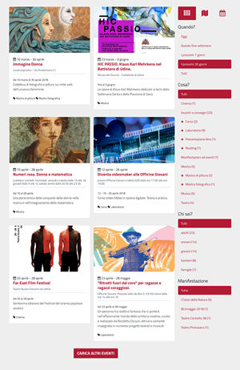

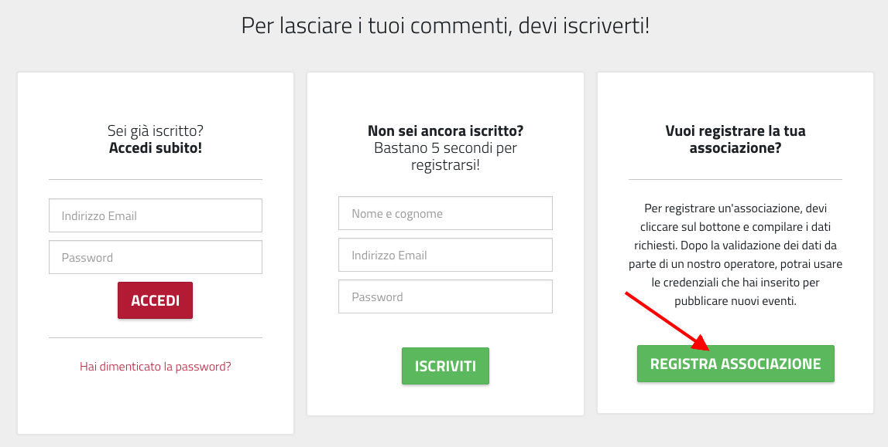

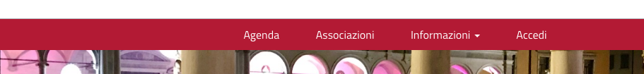

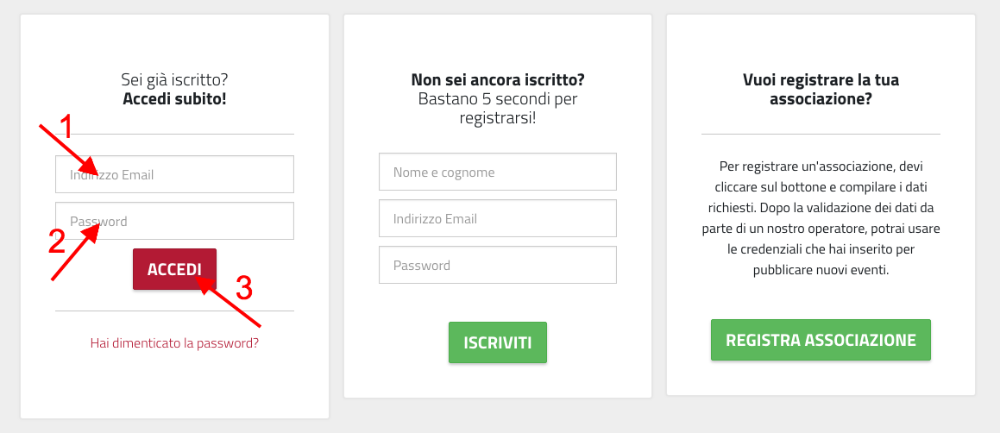

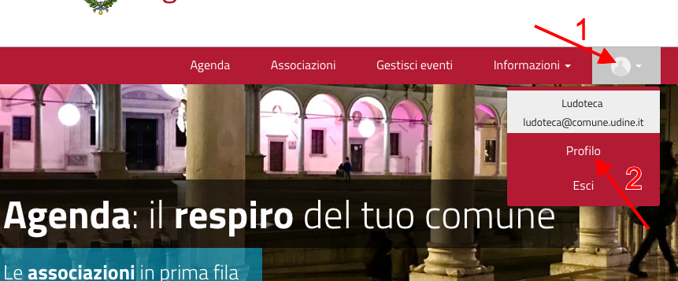

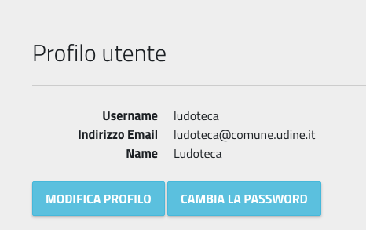

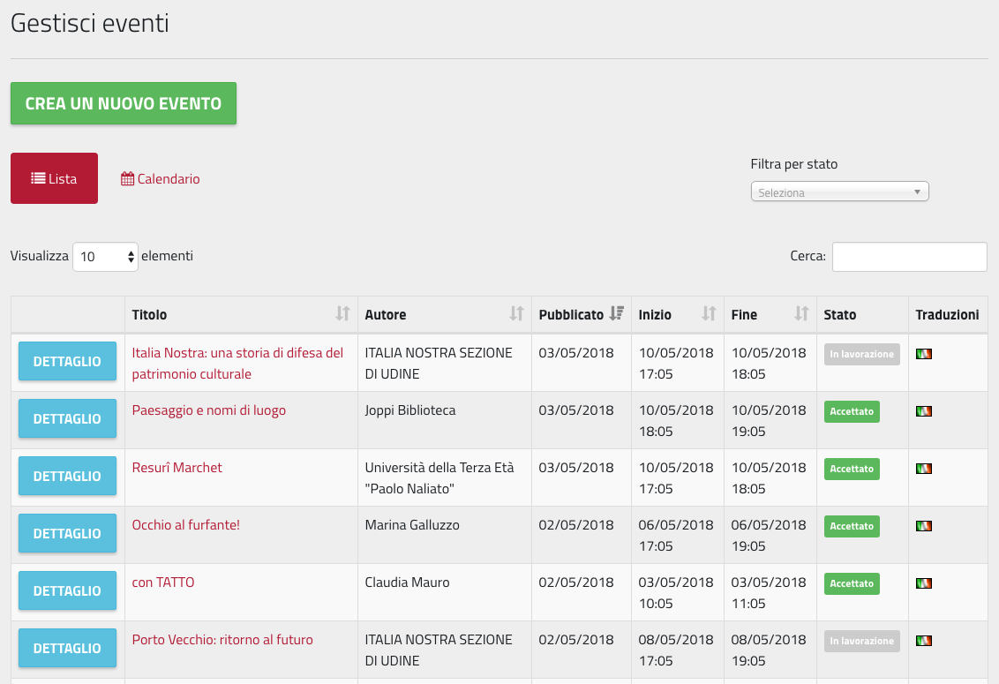

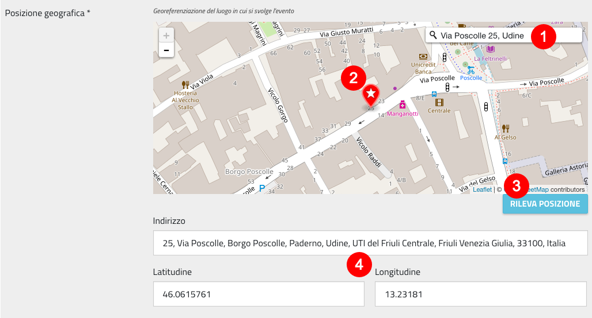

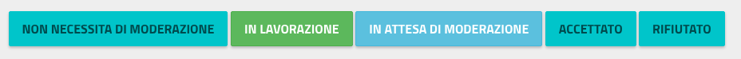

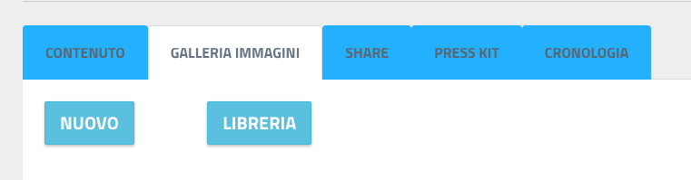

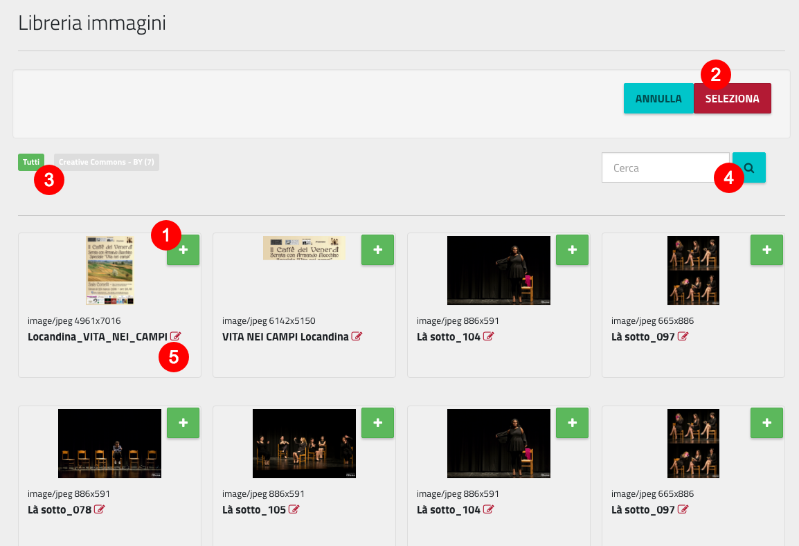

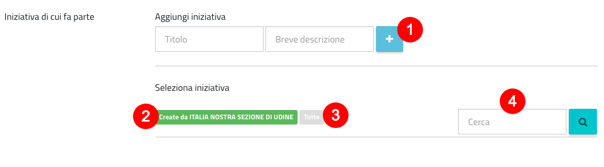

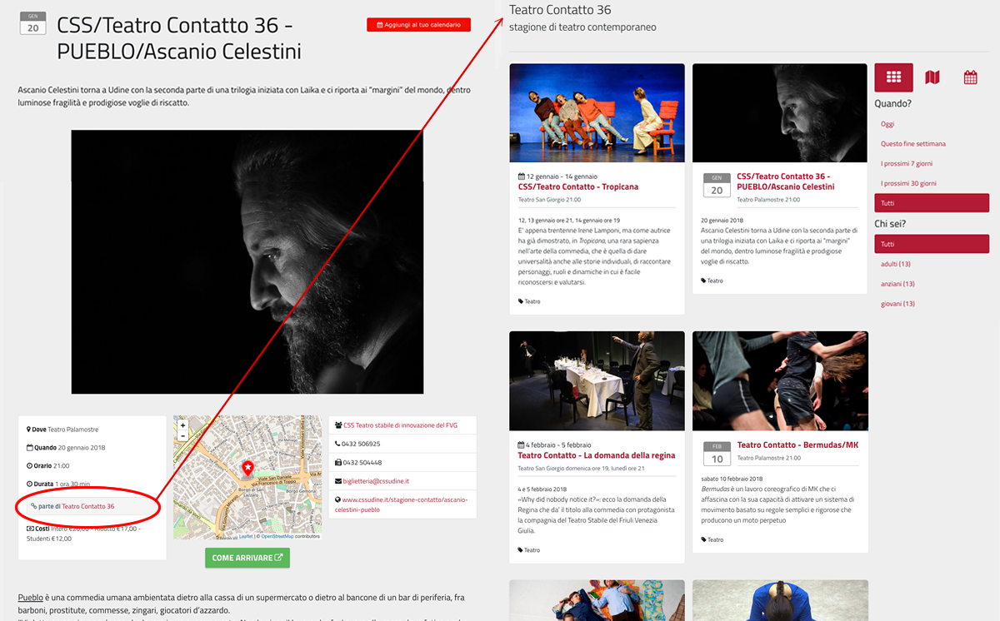

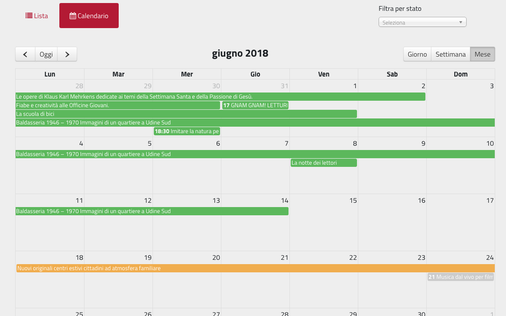
